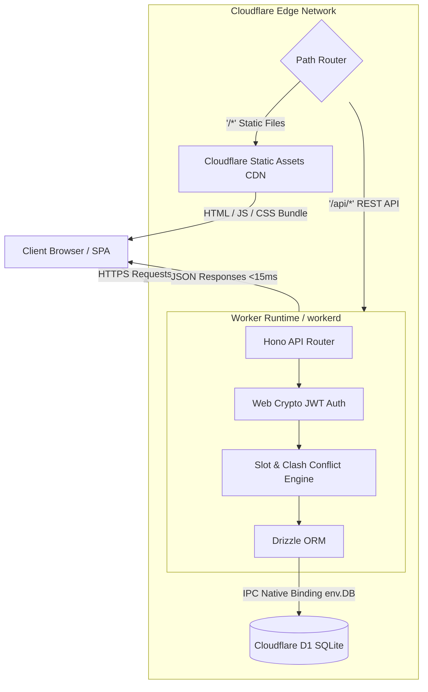

# DeadLines: Edge-Native Clinical Scheduling System

Live Production: [https://deadlines.vyom-uchat.workers.dev](https://deadlines.vyom-uchat.workers.dev)

A multi-tenant healthcare appointment scheduling application engineered for Cloudflare's serverless edge platform. Migrated from a traditional containerized Node.js/MongoDB architecture to a unified Cloudflare Worker running Hono, Cloudflare D1 (Serverless SQLite), Drizzle ORM, and a React 18 single-page application.

The primary system design objective is zero cold starts, zero compute sleep timeouts, and edge-adjacent data locality without ongoing infrastructure costs.

---

## Architecture Overview

The system runs on Cloudflare's global edge network. A single Cloudflare Worker serves both the compiled React frontend static assets and the REST API endpoints under a single domain, eliminating cross-origin preflight latency and CORS configuration drift.



### Request Flow
1. **Asset Resolution**: Static requests (`/`, `/assets/*`) hit Cloudflare's global cache directly. HTML push-state routing resolves fallback requests to `index.html`.
2. **API Execution**: Requests prefixed with `/api/*` route into Hono running inside a V8 isolate.
3. **Database Access**: Database queries execute over internal inter-process communication bindings (`env.DB`) to Cloudflare D1, avoiding TCP connection pool overhead.

---

## Architectural Decisions and Engineering Trade-Offs

### 1. V8 Isolates vs. Containerized Node.js Runtimes
- **Context**: Standard free-tier container platforms (Render, Railway, Fly.io) spin down compute instances after 15 minutes of inactivity. When a cold request arrives, container boot and Node.js runtime initialization cause a 30 to 60-second delay.
- **Decision**: Target Cloudflare Workers (`workerd` runtime).
- **Trade-Off**:
  - *Benefits*: Workers initialize in under 15ms with global edge distribution. Memory consumption is limited to megabytes rather than hundreds of megabytes per container.
  - *Constraints*: Workers enforce a 128 MB memory limit and a 10ms CPU time budget per request on the free plan. Long-running background polling loops or heavy CPU tasks cannot run inside the worker; operations must remain event-driven and I/O-bound.

### 2. Edge Relational Store (Cloudflare D1) vs. Document Store (MongoDB)
- **Context**: The original implementation used MongoDB Atlas via Mongoose. Connecting an edge worker to a cloud MongoDB instance requires either an HTTP-based Data API or maintaining TCP connection pools, adding 50ms to 150ms of network latency per round trip.
- **Decision**: Migrate data storage to Cloudflare D1 using Drizzle ORM.
- **Trade-Off**:
  - *Benefits*: D1 binds directly to the worker isolate via `env.DB`. SQLite read queries execute adjacent to the edge worker without TLS negotiation or external handshakes.
  - *Constraints*: Cloudflare D1 uses SQLite with single-primary write serialization via Write-Ahead Logging (WAL). While reads scale horizontally across edge replicas, write throughput is limited by primary node processing speed. For appointment scheduling, where slot lookups and schedule reads outnumber write commits by roughly 20:1, read-replicated SQLite is structurally well-suited.
  - *Data Modeling*: Flexible BSON documents were converted to strict relational schemas (`users`, `doctors`, `appointments`) with normalized foreign keys and SQL indexing. Recurring doctor availability and date overrides are serialized as typed JSON text columns to maintain fast single-row reads without deep relational joins.

### 3. Scheduling Invariant and Clash Detection Logic
- **Context**: Double-booking a physician damages clinic efficiency and user trust. Conflict detection must run deterministically during slot generation and at the moment of booking submission.
- **Algorithm**: An appointment conflict exists if and only if the requested interval overlaps with an active existing booking:
  $$\text{slotStart} < \text{existingEnd} \land \text{slotEnd} > \text{existingStart}$$
- **Execution**:
  1. Standard weekly availability is evaluated against the target day of the week.
  2. Date-specific overrides take precedence over weekly defaults (e.g. physician taking leave or adjusting working hours).
  3. Existing non-cancelled appointments for that doctor on that date are queried.
  4. Candidate time slots that trigger the overlap condition are filtered out before reaching the client interface.
  5. The booking endpoint re-evaluates the overlap condition immediately before running the SQL `INSERT` to prevent race conditions.

### 4. Web Cryptography API vs. Native Node Binaries
- **Context**: Node.js authentication implementations typically rely on `jsonwebtoken` and native C++ binary bindings like `bcrypt`. Cloudflare Worker V8 isolates do not support native C++ Node addons.
- **Decision**: Standardize authentication on standard Web APIs:
  - Token handling: `hono/jwt` using the Web Crypto API (`HMAC-SHA256`).
  - Password hashing: `bcrypt-ts`, a pure TypeScript implementation compatible with edge workers.
- **Trade-Off**: Marginally higher CPU execution time during password hashing compared to native C libraries, offset by eliminating external infrastructure dependencies and ensuring compatibility across standards-based runtimes.

### 5. Auto-Rolling Demo Lifecycle
- **Context**: Reviewers and recruiters evaluate portfolio projects unpredictably months after the code was deployed. Hardcoded seed dates expire, resulting in empty schedule views and historical-only appointments.
- **Decision**: Implemented an automated date-drift synchronization layer (`ensureFreshDemoData`).
- **Mechanics**:
  - Appointment records are computed dynamically using relative date offsets (`today`, `today + 1`, `today + 2`).
  - When any demo account signs in or queries availability, the system compares the baseline appointment date against the current UTC calendar day.
  - If date drift is detected, the database rolls the dataset forward in approximately 50ms, ensuring upcoming slots and completed appointment histories match the current calendar day.
  - Doctor working hours in demo mode cover all seven days of the week, preventing weekend evaluation blocks.

---

## Persona Matrix and Access Control

Authentication uses role-based access control with signed JWTs stored in browser `localStorage`.

| Persona | Demo Email | Password | Access Scope |
| :--- | :--- | :--- | :--- |
| **Patient** | `patient.john@example.com` | `patientpassword123` | Book consultations, inspect personal appointment history, cancel bookings. |
| **Doctor** | `doctor.sarah@example.com` | `doctorpassword123` | Review schedule calendar, filter by date, set weekly availability and overrides. |
| **Admin** | `admin@example.com` | `adminpassword123` | System oversight, doctor workload metrics, user account moderation, master appointment control. |

An in-app demo banner mounted at the top of the viewport allows one-click persona switching and exposes a manual database reset trigger (`POST /api/demo/reset`).

---

## Database Schema Design

The Drizzle relational schema is defined in `server/src/db/schema.ts`.

### `users` Table
- `id`: Text (UUID, Primary Key)
- `name`: Text
- `email`: Text (Unique, Indexed)
- `password`: Text (Hashed with `bcrypt-ts`)
- `role`: Text (`patient` | `doctor` | `admin`)
- `doctor_profile_id`: Text (Nullable Foreign Key to `doctors.id`)
- `is_active`: Integer (Boolean flag, default 1)
- `created_at`, `updated_at`: Text (ISO timestamps)

### `doctors` Table
- `id`: Text (UUID, Primary Key)
- `user_id`: Text (Foreign Key to `users.id`, Cascading Delete)
- `name`: Text
- `specialization`: Text
- `appointment_duration`: Integer (Minutes, default 30)
- `standard_availability`: Text (JSON string of weekly operating windows)
- `availability_overrides`: Text (JSON string of calendar date exceptions)
- `created_at`, `updated_at`: Text (ISO timestamps)

### `appointments` Table
- `id`: Text (UUID, Primary Key)
- `patient_name`: Text
- `patient_phone`: Text
- `doctor_id`: Text (Foreign Key to `doctors.id`, Cascading Delete)
- `doctor_user_id`: Text (Foreign Key to `users.id`, Cascading Delete)
- `appointment_date`: Text (ISO date string `YYYY-MM-DD`, Indexed)
- `start_time`: Text (Format `HH:MM`)
- `end_time`: Text (Format `HH:MM`)
- `duration`: Integer (Minutes)
- `reason`: Text
- `status`: Text (`scheduled` | `completed` | `cancelled` | `noshow`)
- `remarks`: Text (Physician notes)
- `created_at`, `updated_at`: Text (ISO timestamps)

---

## Local Development and Operations

### Prerequisites
- Node.js 18 or higher
- npm 9 or higher
- Cloudflare Wrangler CLI (`npm i -g wrangler` or via `npx wrangler`)

### Initial Setup
```bash
# Clone the repository
git clone https://github.com/CptPrice743/appointment-scheduling.git
cd appointment-scheduling

# Install dependencies for both root (backend/wrangler) and client
npm install
cd client && npm install && cd ..
```

### Local Database Setup
Run migrations against the local SQLite state managed by Miniflare:
```bash
# Generate SQL migrations via Drizzle Kit (if schema modified)
npm run db:generate

# Apply migrations to local D1 SQLite instance
npm run db:migrate
```

### Running Locally
```bash
# Build client assets for static serving
npm run build:client

# Start the unified Cloudflare Worker dev server on port 8787
npm run dev
```

Visit `http://localhost:8787` to test the application.

For hot module replacement (HMR) during frontend UI work, run Vite on port 3000 in a separate terminal:
```bash
npm run client
```
The Vite development server proxies all `/api/*` traffic directly to `http://localhost:8787`.

### Production Deployment
Deployments run via Wrangler:
```bash
# Build production frontend bundle and deploy Worker + Static Assets
npm run deploy
```

Continuous integration is handled by `.github/workflows/deploy.yml`. When commits land on `main`, GitHub Actions runs the client build and executes `cloudflare/wrangler-action` to publish the updated worker and static assets.